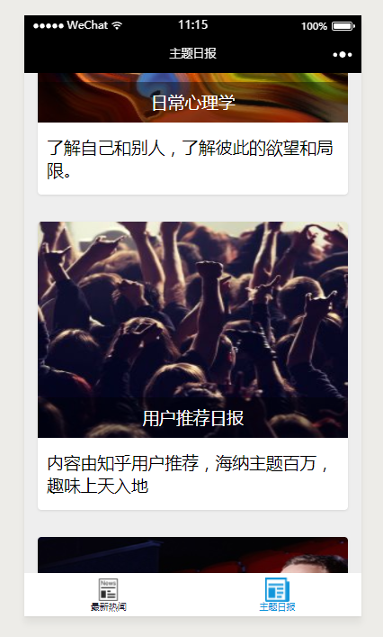

2017年1月9日 张小龙在2017微信公开课Pro上发布的小程序正式上线。
2017年12月28日，微信更新的 6.6.1 版本开放了微信小游戏，并开放了小游戏开发文档和开发者工具。
如今已是2018.1.8 随着小程序入口越来越开放，按捺不住体验了小程序，根据知乎日报API 撸了一个小程序版本的demo。虽说小程序学习成本低，尤其是熟悉Vue、react、angular这些MVVM框架 再上手小程序更是简单的一逼，但开发过程还是有一些坑，只有踩过才知道。

> #### 知乎日报————与世界分享您刚编的经历

- 首页轮播图
- 下拉刷新
- 上拉触底加载更多
- 详情页（用了WxParse 来解析html）
- 页面传参id
- 评论（暂未写入）

    